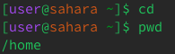
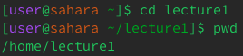
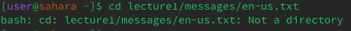
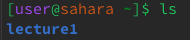
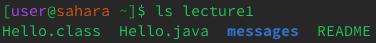
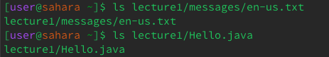
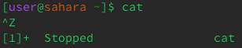
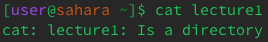
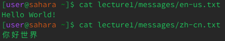

# **Lab Report 1**

## cd
  
  
When I run the cd command empty, it does nothing  
It was run in /home which was the working directory when the command was run  
cd is a command used to put us into directory which becomes the new working directory and as we didnt   state any file name, it didnt change the working directory.  
it is not an error  
  
  
When I run the command, it puts me into a new directory which is the new working directory  
It was run in /home which was the working directory when the command was run  
cd is a command used to put us into a directory and we gave it lecture1, it changed the working  
directory and put us in lecture 1  
it is not an error  
  

When I run the command, it throws an error as it is put in a file and the command cannot put us into a  
file but a directory.  
It was run in /home which was the working directory when the command was run  
cd is the command used to put us into a working directory but we tried to use it to put us in a file and   that is not a directory and that throws and error.  
It is an error as we cannot run the cd command in a file and we need to do it in a working directory.  But when we try to run it on a file it throws and error.  

  
## ls
  
  
When I run the command, it gives us the components of the home directory which is just lecture 1 and  
everything else is under it  
The command only gives us the first components and not the subcomponents  
It was run in /home which was the working directory when the command was run  
ls is a command which shows us the components of the given directory or file and if none is provided it  gives us the components of the working directory  
It is not an error as it gave the components  
  
  
When I run the command, it gives us the components of the given directory provided which is lecture 1  
and we get all its components  
The command only gives us the first components and not the subcontinents  
It was run in /home which is the working directory when the command was run  
ls is a command which shows us the components of the given directory or file and if none is provided it  gives us the components of the working directory  
It is not an error as it gave the components  
  
  
When I run the command, it gives me the path of the name of the file and as it was in the home directory the command was run, it gives us the path  
It was run in /home which is the working directory when the command was run  
ls is a command which shows us the components of the given directory or file and if none is provided it  gives us the components of the working directory  
But this time when we run the command, it just gives us the file as there is no file under it and it is  the final file and has no files under it  
We are just getting the path of the file as that is what we had given  
It is not an error  
  
## cat
  
  
When I run the command it puts us in an unknown place which just repeats what u put in it  
It just concatinates the given commands and to get out of it i used ctrl+z  
It was run in /home which is the working directory when the command was run  
it is a command which usually gives us the components of the given directory or file  
This time when we run the command, it puts us into a space which concats anything in the given space.  
It is not an error but it is also not the desired outcome  
  
  
When I run the command it gives us all the components of the directory lecture1  
It was run in /home which is the working directory when the command was run  
It gives us the components of the given file or directory and thats exactly what I got  
It is not an error  
  
  
When I run the command it gives me the components of the given file  
It was run in /home which is the working directory when the command was run  
It gives us whats in the file like Hello World! which is in the en-us.txt   
The time when we run the command, it gives us the concatinated files.  
It is not an error  
