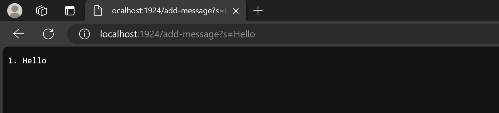
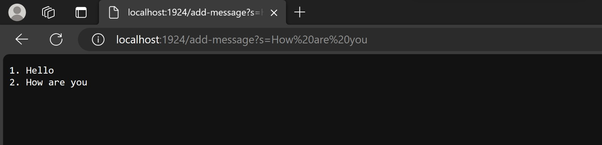
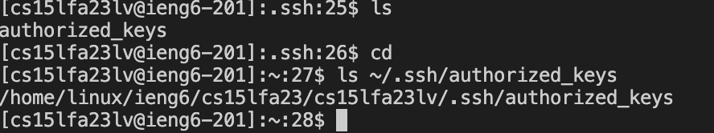

# Lab Report 2  
## Part 1  
### code  
  
### Server  
  
In this screenshot, I used `handleRequest`  
In this, I used a `url` which is from URI and the port number used was 1924, then it becomes localhost:1924/ and then i used the query localhost:1924/add-message?s=Hello  
This class used `getPath()` and that shows it dosent change even when the URL changes.  
Using `getQuery()` helped me get the value of the screenshot to change. I used `s=Hello` here.
so the number is 0 originally and when an input it given for the first time, it takes the number and adds one to it and then the code given in the code image, shows that the line given shows that the vairable num is what is the first thing on each line and every time a new line is given, the number increments by 1 which is why each line given will have the next number.  
To know how to make the next thing added go to the next line, I use the `"/n"` command which helps to go to the next line.
  
In the screenshot, I used `handleRequest`
In this, I used a `url` which is from the URI class, I use the port number 1924, then it becomes localhost:1924/ and   
then i used localhost:1924/add-message?s=How%20are%20you  
In this class I used `getPath()` and that shows that it dosent change even when the URL is changed.  
It takes the same path as the previous path and the value is `/add-messages`  
I also used `getQuery()` and the value changed in the screenshots, the value is `How%20are%20you`.  
so the number is 0 originally and became 1 in the last line, when an input it given for the second time, it takes 1 and adds one to it and then the code given in the code image, shows that the line given shows that the vairable num is what is the first thing on each line and every time a new line is given, the number increments by 1 which is why each line given will have the next number.  
To know how to make the next thing added go to the next line, I use the `"/n"` command which helps to go to the next line.

## Part 2  
### Logging into ieng6 account without password  
  
### Public path  
  
### Private path  

## Part 3
In these 2 weeks of lab. Some things are how to access remote servers from our laptops terminal. I think this will be extremely useful in my whole career so that I can run difficult to run 
commands from my laptop on remote servers and be able to work on something else at the same time. There are multiple terminal commands like `mkdir` and `scp` as well. I even know how to host servers
on the internet and other useful things. This class is probably one of the most useful classes for me in CS.
