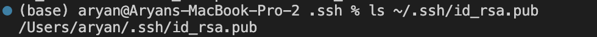

# Lab Report 2  
## Part 1  
### code  
  
### Server  
  
  
In the screenshot, I used `handleRequest`
In this, I used a `url` which is from the URI class, I use the port number 1924, then it becomes localhost:1924/ and   
then I did localhost:1924/add-message?s=Hello  
at the end i used localhost:1924/add-message?s=How%20are%20you  
In this class I used `getPath()` and that shows that it dosent change even when the URL is changed.  
It takes the same path as the previous path and the value is `/add-messages`  
I also used `getQuery()` and the value changed in the screenshots, the values are `s=Hello`, and `How%20are%20you`.  

## Part 2  
### Logging into ieng6 account without password  
  
### Public path  
  
### Private path  

## Part 3
In these 2 weeks of lab. Some things are how to access remote servers from our laptops terminal. I think this will be extremely useful in my whole career so that I can run difficult to run 
commands from my laptop on remote servers and be able to work on something else at the same time. There are multiple terminal commands like `mkdir` and `scp` as well. I even know how to host servers
on the internet and other useful things. This class is probably one of the most useful classes for me in CS.
