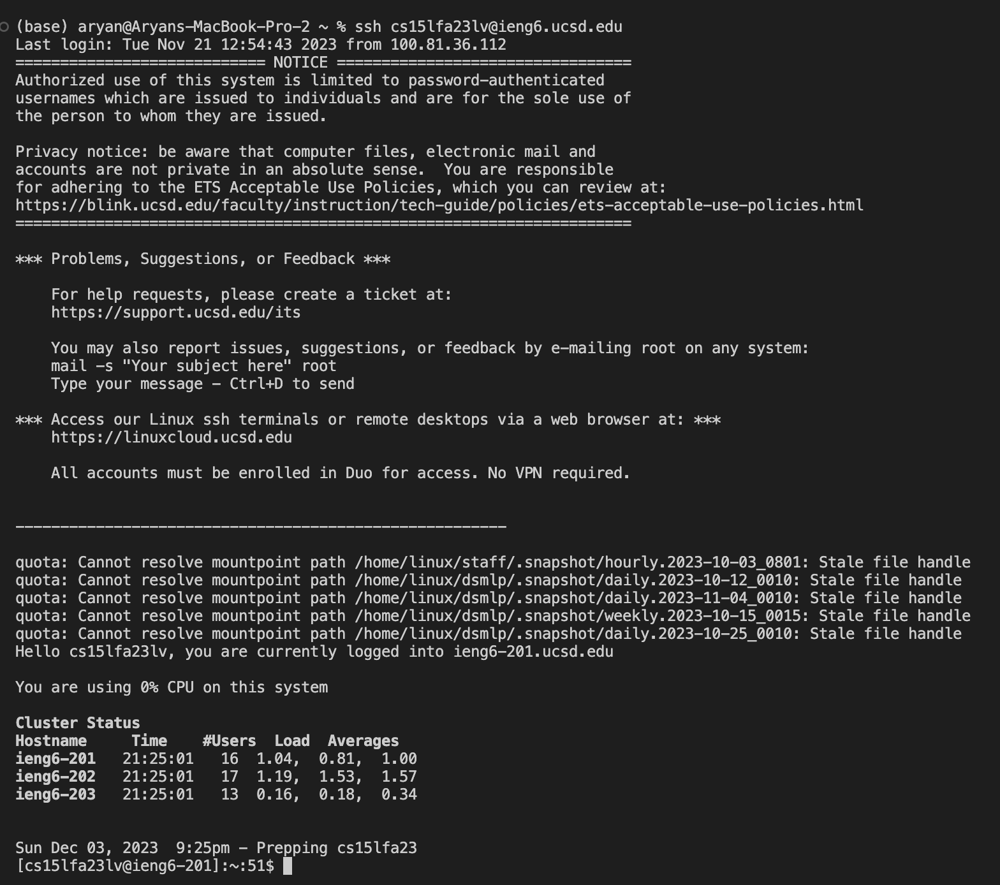
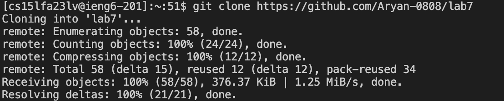
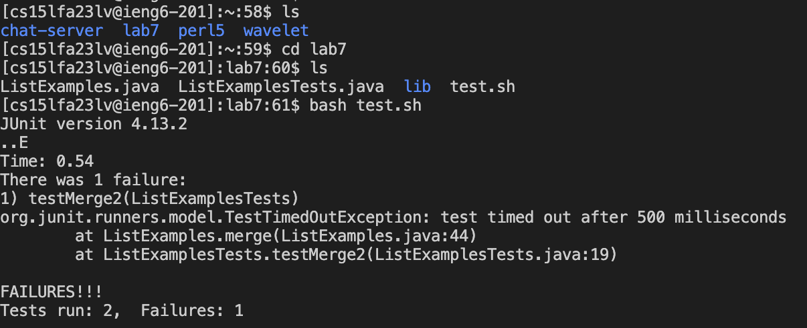
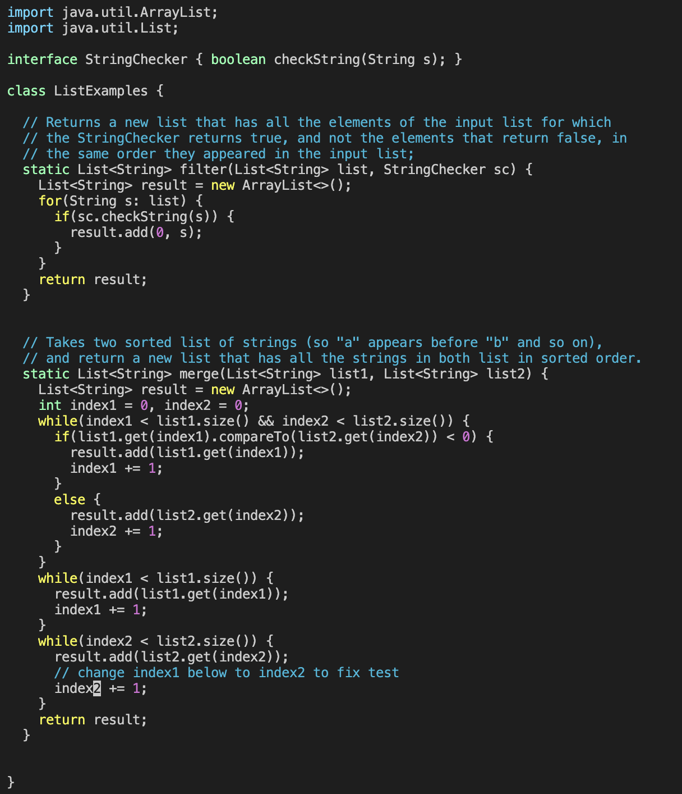
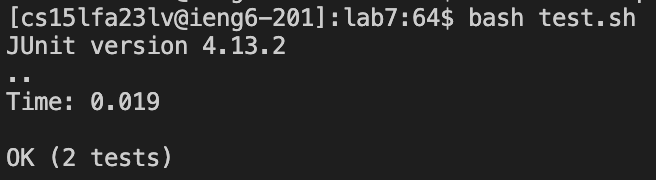
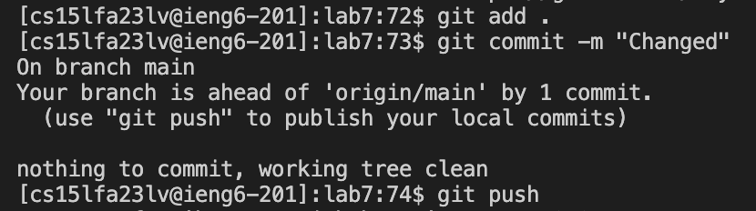
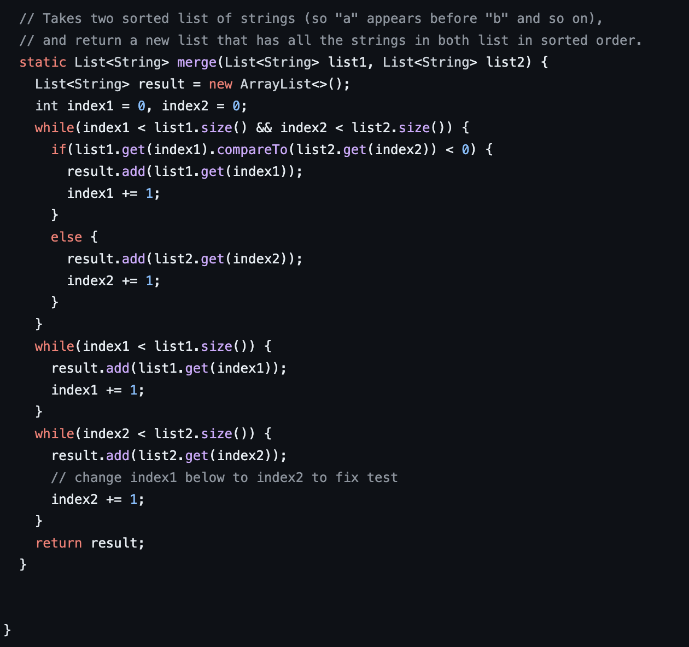

# Lab Report 4 - VIM  
## Logging into ieng6  

Command:  ```ssh cs15lfa23lv@ieng6.ucsd.edu```
I looked for the command in lab 2 and i changed the last 2 letters to log into my own account.  

## Cloning the fork of the repository  
  
Command ```git clone https://github.com/Aryan-0808/lab7```  
I used this command to git clone my repository which i forked


## Running the Tests  
  
Command ```ls  
cd lab7  
ls  
bash test.sh```
I entered the directory like this and ran the tests.  
## Editing code to make sure the tests succeed  

  
Command:  ```vim ListExamples.java```

I used <k> and <l> to move to the lines where i had to change the code.  
<k> to move down in vim editor   
<l> to move right in vim editor  
Once i reached the line, I used <x> to remove 1 from the line i had to remove it from  
Then after removing 1, I used <i> to insert 2 into the same line in place of 1  
To get out of the insert mode, I used <ESC> which put me in normal mode  
Then in normal mode i type `:wq` to save the changes I made in the vim editor to `ListExamples.java`  
## Running the Tests  
  
Command:  ```bash test.sh```  
I ran this to check if all my tests ran successfully after the changes.  

## Pushing the changes  
  
Command:  ```git add .  git commit -m "Changed"  git push```
This was used to make sure that the changes were made on the forked repository on my github. In the screenshot below shows the changes commited. Towards the end of the screenshot is the changed line.  
  
